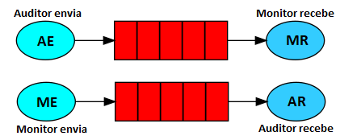

# Projeto prático: Jogo de captura de bandeiras

# Arquitetura do sistema


# Requisitos
## 1. Atendidos: 

O Software realizar a comunicação entre o auditor, monitorGUI e jogadores através do servidor RabbiMQ.
Para a comunicação do auditor com o monitorGUI, é utilizado uma fila simples, no qual o auditor envia para o monitorGUI. E em outra fila, o monitorGUI envia para o auditor. 



E para a comunicação com do auditor com os jogadores, é utilizado uma fila do tipo Publish/Subscribe, no qual, a mensagem é enviada para cada jogador.


No GIF abaixo está um exemplo para demonstrar o funcionamento do Jogo de captura de bandeiras compilado no localhost.


## 2. Não atendidos: 
O jogo foi construído sobre contêineres Docker. Mas quando é executado o comando `docker-compose up auditor` o contêiner não sobe.


# Instruções para compilar o jogo 

#### Executar o docker-compose

```
docker-compose build
```

1. Abra um terminal e execute o rabbitMQ
```
docker-compose up rabbitMQ
```

2. Abra um outro terminal e execute o Auditor
```
docker-compose up auditor
```

3. Abra um outro terminal e execute o Jogador1
```
docker-compose up jogador1
```

4. Abra um outro terminal e execute o Jogador2
```
docker-compose up jogador2
```

#### E por último executar o MonitorGUI
5. Em uma aba do terminal execute a linha abaixo.

```
java -cp build/libs/monitorGUI-1.0.jar:libs/amqp-client-5.7.1.jar:libs/slf4j-api-1.7.26.jar:libs/algs4.jar monitor.Principal
```
